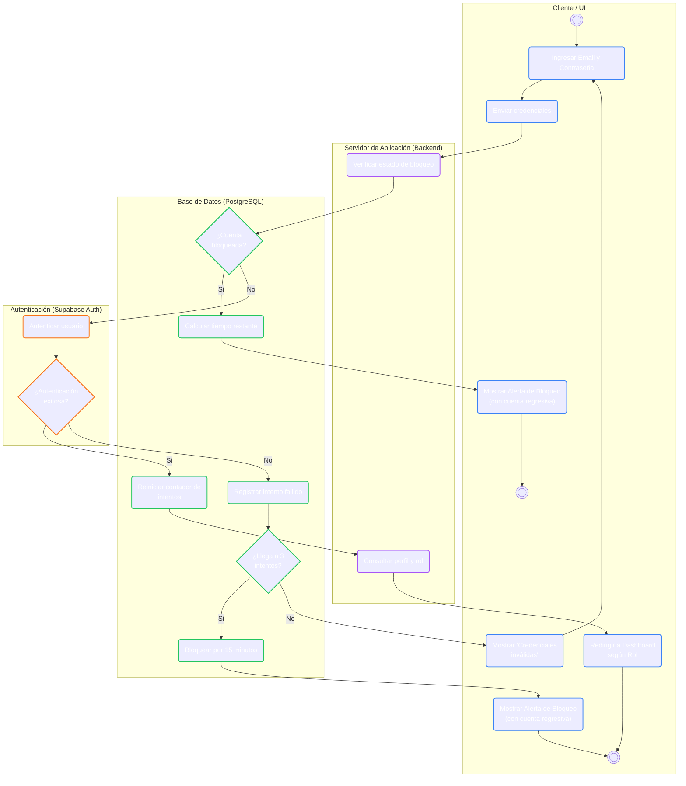

# Sistema de Gestión de Incidencias con SLA — Sustentación Oficial Sprint 1

**Curso Integrador II: Software — Ciclo 2026-2**
**Equipo:** Maycol Quicaño · Jorge Vilca · Jeremy Poma · Daniel Turin

# Sprints
[https://docs.google.com/spreadsheets/d/1x_DaMhhITYa1_8OguCNOyu8bmSJwqthRL3iffqPAO2I/edit?gid=0#gid=0]

# Figma
[https://www.figma.com/design/qG39XU4qS3c1EwTQDdRQg7/prueba?node-id=0-1&t=xeYXYD1YWbwDcEII-0]

# Problema

La empresa Quimesa abarca la industria de insumos quimicos y de la fabricacion de productos, sin embargo sus procesos de gestion de incidencias son manuales y no existe un programa de automatizacion de ello. Esta necesidad nos lleva a crear un sistema de gestion de incidencias para facilitar y agilizar los procesos en la empresa.

### Estructura del equipo y asignación del Sprint 1

Distribución de roles Scrum e historias de usuario según la planificación del Sprint 1 (una HU por integrante):

| Integrante | Rol Scrum | Historia asignada (Sprint 1) | Duración | Rol funcional en el sistema |
| :--- | :--- | :--- | :---: | :--- |
| **Maycol Quicaño** | **Product Owner** | **HU01** — Acceder al sistema | 5 días | Autenticación (Supabase Auth + JWT) |
| **Jorge Vilca** | **Scrum Master** | **HU02** — Registrar un nuevo usuario | 5 días | Gestión de usuarios y roles |
| **Jeremy Poma** | **Developer** | **HU03** — Consultar los usuarios | 5 días | Monitoreo de cuentas, roles y permisos |
| **Daniel Turin** | **Developer** | **HU04** — Actualizar perfil de usuario | 5 días | Edición de datos de perfil |

### Team Work

* **Integración continua obligatoria:** cada `push` o `pull_request` contra `main` dispara el pipeline de GitHub Actions (checkout → Node.js LTS 24 → instalación limpia de dependencias → pruebas Jest → build de producción).
* **Rama principal protegida:** ningún cambio se integra a `main` sin pasar el pipeline al 100 % y sin cobertura de código ≥ 80 %.
* **Aprobación formal de despliegue:** **Maycol Quicaño**, como Product Owner, audita el cumplimiento de los criterios de aceptación en el entorno de **Staging** antes de autorizar la fusión hacia producción.
* **Facilitación del marco Scrum:** **Jorge Vilca**, como Scrum Master, conduce las ceremonias (Planning, Daily, Review, Retrospectiva) y remueve impedimentos del equipo.
* **Desarrollo del incremento:** **Jeremy Poma** y **Daniel Turin**, como Developers, construyen, prueban y documentan las historias técnicas de cada Sprint.

## Product Backlog — Sprint 1

### 2.1 Ficha del Sprint 1

### ⏱️ Duración
| Parámetro | Tiempo |
| :--- | :--- |
| **Duración** | 4 semanas |

### 📋 Sprint Backlog
| ID | Historia de Usuario |
| :---: | :--- |
| **HU01** | COMO usuario QUIERO iniciar sesión PARA acceder al sistema. |
| **HU02** | COMO Jefe de TI QUIERO registrar un nuevo usuario PARA otorgarle acceso a la plataforma con su rol correspondiente. |
| **HU03** | COMO Jefe de TI QUIERO consultar los usuarios PARA monitorear las cuentas, roles y permisos activos en el sistema. |
| **HU04** | COMO Usuario QUIERO actualizar mi perfil PARA modificar mis datos vigentes. |

### 👥 Equipo y Roles Scrum
| Rol | Integrante |
| :--- | :--- |
| **Product Owner** | Maycol Quicaño |
| **Scrum Master** | Jorge Vilca |
| **Developer 1** | Jeremy Poma |
| **Developer 2** | Daniel Turin |

**Producto:** Sistema Web de Gestión de Incidencias

### 2.2 Historias de Usuario del Sprint 1

| ID | Historia de Usuario (Sprint 1) | Sprint / Duración |
| :---: | :--- | :---: |
| **HU01** | COMO usuario QUIERO iniciar sesión PARA acceder al sistema. | 2 Semanas |
| **HU02** | COMO Jefe de TI QUIERO registrar un nuevo usuario PARA otorgarle acceso a la plataforma con su rol correspondiente. | 2 Semanas |
| **HU03** | COMO Jefe de TI QUIERO consultar los usuarios PARA monitorear las cuentas, roles y permisos activos en el sistema. | 2 Semanas |
| **HU04** | COMO Usuario QUIERO actualizar mi perfil PARA modificar mis datos vigentes. | 2 Semanas |

### 2.3 Historias de Usuario por días — Sprint 1

| ID | Historia de Usuario por días - Sprint 1 | Días | Asignado a |
| :---: | :--- | :---: | :--- |
| **HU01** | COMO usuario QUIERO iniciar sesión PARA acceder al sistema. | 5 | Maycol Quicaño (PO) |
| **HU02** | COMO Jefe de TI QUIERO registrar un nuevo usuario PARA otorgarle acceso a la plataforma con su rol correspondiente. | 5 | Jorge Vilca (SM) |
| **HU03** | COMO Jefe de TI QUIERO consultar los usuarios PARA monitorear las cuentas, roles y permisos activos en el sistema. | 5 | Jeremy Poma (Dev) |
| **HU04** | COMO Usuario QUIERO actualizar mi perfil PARA modificar mis datos vigentes. | 5 | Daniel Turin (Dev) |

## Product Backlog Maestro - Requerimientos Funcionales

| ID | Historia de Usuario | Sprint |
| :---: | :--- | :---: |
| **HU06** | Registrar un ticket de incidencia | Sprint 2 |
| **HU07** | Consultar tickets de incidencia | Sprint 2 |
| **HU08** | Actualizar el estado de un ticket | Sprint 2 |
| **HU09** | Registrar una prioridad de servicio (SLA) | Sprint 3 |
| **HU10** | Registrar un artículo de conocimiento | Sprint 3 |
| **HU11** | Consultar la base de conocimientos | Sprint 3 |
| **HU12** | Registrar un equipo informático | Sprint 3 |
| **HU13** | Consultar equipos informáticos | Sprint 4 |
| **HU14** | Actualizar la ficha de un equipo informático | Sprint 4 |
| **HU15** | Registrar disponibilidad de técnicos | Sprint 4 |
| **HU16** | Consultar la disponibilidad de los técnicos | Sprint 4 |
| **HU17** | Registrar una evaluación de servicio | Sprint 5 |
| **HU18** | Auditar y actualizar el estado final de un ticket de incidencia | Sprint 5 |
| **HU19** | Consultar las evaluaciones de servicio | Sprint 5 |
| **HU20** | Generar reporte de cumplimiento de SLA | Sprint 5 |
| **HU22** | Generar reporte del historial de fallas por equipo informático | Sprint 6 |
| **HU23** | Generar reporte de las evaluaciones de satisfacción | Sprint 6 |
| **HU24** | Generar reporte sobre los artículos de conocimiento más consultados | Sprint 6 |

## Especificación de la Historia prioritaria del Sprint 1: HU01 — Acceder al sistema

Escenario 1: Inicio de sesión exitoso
  Dado que el usuario tiene una cuenta activa registrada con credenciales válidas
  Cuando ingresa su correo electrónico y contraseña y presiona "Iniciar Sesión"
  Entonces el sistema valida las credenciales contra Supabase Auth
  Y verifica el rol asociado en la tabla "perfiles"
  Y abre una sesión segura mediante un token JWT
  Y redirige al panel correspondiente según su rol (usuario, técnico o jefe de TI).

Escenario 2: Credenciales inválidas
  Dado que el usuario ingresa un correo o contraseña incorrectos
  Cuando el sistema detecta que las credenciales no coinciden
  Entonces muestra el mensaje "Correo o contraseña incorrectos"
  Y registra el intento fallido asociado a la cuenta.

Escenario 3: Bloqueo temporal por intentos fallidos
  Dado que el usuario acumula tres intentos fallidos consecutivos
  Cuando intenta autenticarse nuevamente
  Entonces el sistema bloquea la cuenta durante 15 minutos
  Y muestra un temporizador dinámico de cuenta regresiva en el frontend
  Y bloquea cualquier intento de autenticación mientras el bloqueo esté activo.

**Datos técnicos asociados:**
- Gestión de sesión con **Supabase Auth** + token **JWT**.
- Contador de intentos fallidos y bloqueo temporal persistidos en la tabla `perfiles`.
- Importancia: **Vital** · Urgencia: **Alta** · Frecuencia esperada: **Alta**.

### Diagrama de flujo — HU01: Acceder al sistema

## Arquitectura y decisión formal de stack tecnológico

### 4.1 Stack tecnológico
| Capa | Tecnología | Justificación documentada |

| Frontend + Backend | **Next.js 15** (Server Components/Actions, SSR) | Unifica cliente/servidor; permite cookies `HttpOnly` seguras y previene XSS. |
| Lenguaje | **TypeScript 5.x** | Tipado estático como contrato de datos entre UI y servicios. |
| Estilos | **Tailwind CSS 4.x** | Utilidades consistentes, responsividad, microinteracciones. |
| Base de datos | **PostgreSQL** | Integridad referencial y transacciones ACID. |
| BaaS | **Supabase (supabase-js v2)** | Autenticación gestionada + cliente de conexión a PostgreSQL. |

### 4.2 Arquitectura multicapas
Presentación (Next.js + React + Tailwind) → Lógica de negocio (Servicios: `AuthService`, `UsuarioService`...) → Acceso a datos (Patrón Repositorio: `PerfilesRepository`, `IncidenciasRepository`...) → Persistencia (PostgreSQL / Supabase Auth).

El **Patrón Repositorio** aísla las llamadas a Supabase; si el proveedor de identidad cambiara (p. ej. a Auth0), solo se modificaría la clase repositorio correspondiente, sin tocar la lógica de negocio ni la UI.

## Diseño UX/UI — Mockups en Figma

### 5.1 Sistema de diseño 
* **Paleta:** azul primario `#2563eb` (acciones principales), gris azulado `#f8fafc` / `#e2e8f0` (fondos y bordes), rojo `#ef4444` (errores y bloqueos).
* **Tipografía:** familia sans-serif *Inter* / *Outfit*, jerarquía `font-bold` (700) para títulos, `font-medium` (500) para etiquetas, `font-normal` (400) para texto de soporte.
* **Componentes:** esquinas `rounded-2xl` (16px), campos `py-3 px-4`, foco con anillo `focus:ring-2 focus:ring-[#2563eb]`, botones con transición y microanimación en `hover`.
* **Componentes reutilizables:** alerta de error, contador de intentos, tarjetas, modales emergentes.

## Módulo diferenciador: Cumplimiento de SLA

Como el nombre del proyecto lo indica, el sistema no solo gestiona incidencias, sino que **mide su cumplimiento contra Acuerdos de Nivel de Servicio**. Esto está desarrollado en dos historias clave:

### 6.1 HU09 — Registrar una prioridad de servicio (Sprint 3)
* **Actor:** Jefe de TI.
* **Función:** registra niveles de prioridad (Crítica, Alta, Media, Baja) definiendo **tiempos de respuesta y resolución en horas**, persistidos en la tabla `prioridades_servicio`.
* Cada incidencia (`N`) aplica exactamente una prioridad de servicio (`1`).

### 6.2 HU20 — Generar reporte de cumplimiento de SLA (Sprint 5)
* **Actor:** Jefe de TI.
* **Función:** compara los tiempos reales de respuesta/resolución de cada ticket contra los tiempos acordados por prioridad; muestra tarjetas KPI, barras de progreso por prioridad y tabla detallada; permite exportar a PDF/Excel.
* **Reglas de negocio (RN):**
  - RN-01: Solo el Jefe de TI accede al módulo.
  - RN-02: Tiempo de respuesta = `actualizado_en` − `creado_en`.
  - RN-03: Tiempo de resolución = `fecha_cierre` (o `actualizado_en` en estado resuelto) − `creado_en`.
  - RN-04: Un ticket "Cumple SLA" solo si satisface **simultáneamente** el tiempo de respuesta y el de resolución.
* **Excepción:** un ticket con prioridad sin SLA configurado se marca como "Sin SLA" y se excluye del cálculo del porcentaje.

## Control de ingeniería en GitHub

### 7.1 Pipeline de Integración Continua (GitHub Actions) 
1. **Checkout:** descarga el código del repositorio.
2. **Entorno:** instala Node.js LTS 24.
3. **Dependencias:** instalación limpia (`npm ci`).
4. **Pruebas:** ejecuta la suite Jest; el pipeline se detiene si alguna prueba falla.
5. **Build:** compila con Next.js/TypeScript, validando ausencia de errores de tipado.

### 7.2 Reglas de fusión y despliegue
* Disparadores: `push` o `pull_request` contra `main`.
* Bloqueo de *merge* si la cobertura de pruebas es menor al 80 % o si la tasa de éxito de pruebas es menor al 100 %.
* **Despliegue continuo en Vercel:** cada fusión autorizada a `main` despliega automáticamente a producción.
* Variables de entorno (credenciales Supabase) aisladas en el panel de Vercel, nunca en el código fuente.
* **Aprobación formal:** Maycol Quicaño, como Product Owner, valida en **Staging** el 100 % de los criterios de aceptación antes de autorizar el paso a producción.

## Presentacion localhost

1. **Entorno local:** `Node.js LTS 24` + Next.js corriendo en `http://localhost:3000/`
2. **Flujo HU01 (login):** iniciar sesión con credenciales válidas → verificar redirección por rol → forzar 3 intentos fallidos → mostrar bloqueo temporal con temporizador.
3. **Flujo HU02 (registrar usuario):** Jefe de TI crea una cuenta nueva asignando rol.
4. **Flujo HU03 (consultar usuarios):** listar cuentas activas con sus roles y permisos.
5. **Flujo HU04 (actualizar perfil):** el usuario edita y guarda sus datos vigentes.
