# Arquitectura Aplicada — Sistema de Gestión de Incidencias con SLA

Documento técnico derivado del **código implementado** en este repositorio.

---

## 1. Planificación y Asignación del Sprint 2

### 1.1 Estructura del equipo y responsabilidades en Sprint 2

Distribución de roles Scrum, historias de usuario asignadas y alcance técnico detallado para cada integrante durante el Sprint 2:

| Integrante | Rol Scrum | Historia asignada (Sprint 2) | Días | Responsabilidad funcional y técnica |
| :--- | :--- | :--- | :---: | :--- |
| **Maycol Quicaño** | **Product Owner** | **HU-005** — Recuperar contraseña | 5 días | Implementación de flujo de recuperación de contraseña segura vía enlace temporal / correo, validación de criterios de aceptación de seguridad. |
| **Jorge Vilca** | **Scrum Master** | **HU-006** — Registrar ticket de incidencia | 5 días | Formulario y endpoint de alta de incidencias (`/tickets`), validación de datos iniciales, nivel de criticidad y canalización de tickets nuevos. |
| **Jeremy Poma** | **Developer** | **HU-007** — Consultar tickets de incidencia | 5 días | Módulo de consulta y listado con filtrado por rol y nivel de acceso (`GET /tickets`), soporte para vista de usuario y vista de gestión. |
| **Daniel Turin** | **Developer** | **HU-008** — Actualizar estado del ticket | 5 días | Lógica y endpoints para cambio de estados (`Abierto`, `En Progreso`, `Resuelto`, `Cerrado`) con trazabilidad y notificaciones para Técnico / Jefe TI. |

### 1.2 Reglas de trabajo del equipo (Team Work)

- **Integración continua obligatoria:** cada `push` o `pull_request` contra `main` dispara el pipeline de CI (checkout → Node.js LTS 24 → instalación limpia de dependencias → validación de tipos y lint → build de producción).
- **Rama principal protegida:** ningún cambio se integra a `main` sin pasar el pipeline al 100 % y sin revisión de código.
- **Aprobación formal de despliegue:** **Maycol Quicaño** (Product Owner) audita y certifica los criterios de aceptación en entorno de **Staging** antes de autorizar el pase a producción.
- **Facilitación del marco Scrum:** **Jorge Vilca** (Scrum Master) conduce las ceremonias del Sprint 2 (Daily, Review, Retrospectiva) y gestiona el desbloqueo de impedimentos técnicos.
- **Desarrollo del incremento:** **Jeremy Poma** y **Daniel Turin** (Developers), junto con el equipo, implementan componentes React, servicios REST y consultas SQL para los tickets de incidencia.

---

## 2. Product Backlog — Sprint 2

### 2.1 Ficha del Sprint 2

#### ⏱️ Duración y Parámetros
| Parámetro | Detalle |
| :--- | :--- |
| **Sprint** | Sprint 2 — Módulo de Incidencias y Recuperación de Accesos |
| **Duración estimada** | 2 semanas (5 días de desarrollo por historia) |
| **Objetivo del Sprint** | Permitir la autogestión de contraseñas y habilitar el ciclo de vida completo de incidencias (creación, consulta con permisos y avance de estados). |

#### 📋 Sprint Backlog Detallado

| ID | Historia de Usuario | Días | Asignado a |
| :---: | :--- | :---: | :--- |
| **HU-005** | **COMO** Usuario<br>**QUIERO** recuperar mi contraseña en caso de olvido<br>**PARA** volver a acceder a mi cuenta de forma segura. | 5 | Maycol Quicaño *(PO)* |
| **HU-006** | **COMO** Usuario<br>**QUIERO** registrar un ticket de incidencia<br>**PARA** recibir atención técnica inmediata ante una falla. | 5 | Jorge Vilca *(SM)* |
| **HU-007** | **COMO** Usuario<br>**QUIERO** consultar los tickets de incidencia<br>**PARA** gestionar y hacer seguimiento al estado del soporte técnico según mi nivel de acceso. | 5 | Jeremy Poma *(Dev)* |
| **HU-008** | **COMO** Técnico, Jefe TI<br>**QUIERO** actualizar el estado de un ticket de incidencia<br>**PARA** reflejar el avance del proceso de atención y mantener informados a los usuarios. | 5 | Daniel Turin *(Dev)* |

---

## 3. Visión general del Sistema

Monorepo gestionado con **npm workspaces**: un único `package.json` en la raíz coordina dos paquetes independientes.

| Paquete | Rol | Tecnologías principales |
| :--- | :--- | :--- |
| `proyecto-integrador-back` | API REST (Express + TypeScript), expone rutas bajo `/api/v1` | Node.js, Express 5, PostgreSQL (`pg`) |
| `proyecto-integrador-front` | SPA (React + Vite + Tailwind CSS), consume la API por rutas relativas | React 19, Vite 8, React Router 7, Tailwind 4 |

- **Runtime:** Node.js ≥ 24 (fijado en `.nvmrc` y en `engines` de los tres `package.json`).
- **Arranque:** `npm install` en la raíz + `npm run dev` (levanta back y front en paralelo con `concurrently`).
- **Comandos globales:** `dev`, `build`, `typecheck`, `lint`.

---

## 4. Arquitectura aplicada

### 4.1 Estilo arquitectónico

- **Backend:** arquitectura **multicapa** sobre un único proceso Express (monolito modular), con separación estricta de responsabilidades.
- **Frontend:** **SPA por capas** con enrutado declarativo, guardas por rol y una capa de servicios aislada del DOM.
- **Patrón clave:** **Patrón Repositorio** — el SQL vive únicamente en `src/repositories/*`; servicios y controllers nunca tocan la base de datos directamente.

### 4.2 Flujo de una petición

```text
UI (componente/page)
  → capa de servicios del front (src/services/*Api.ts)
    → apiClient (fetch genérico apiGet / apiSend, base /api/v1)
      → proxy de Vite (/api → http://localhost:3000)        [desarrollo]
        → Express: routes → controllers → services → repositories
          → PostgreSQL (pool pg, SQL parametrizado)
```

#### Diagrama de arquitectura

```mermaid
%%{init: {'flowchart': {'nodeSpacing': 15, 'rankSpacing': 25}}}%%
flowchart LR
    subgraph FRONT[" "]
        direction TB
        F_TITLE["🖥️ <b>FRONTEND · SPA</b><br/><small>React 19 + Vite 8 + Tailwind 4</small>"]
        CTX["🔐 Context<br/>SessionProvider"]
        P["📄 Pages / Components<br/>RequireAuth · RequireRoles"]
        SVC_F["🧩 Services<br/>ticketsApi · usersApi ..."]
        API["🔌 apiClient<br/>apiGet / apiSend"]

        F_TITLE ~~~ CTX
        CTX -.-> P
        P --> SVC_F
        SVC_F --> API
    end

    PROXY{{"🔀 Proxy Vite<br/>/api → localhost:3000"}}

    subgraph BACK[" "]
        direction TB
        B_TITLE["⚙️ <b>BACKEND · API REST</b><br/><small>Express 5 + TypeScript · /api/v1</small>"]
        MW["🛡️ Middlewares<br/>notFound · errorHandler"]
        R["🛣️ Routes<br/>/tickets /users /sla<br/>/equipments /reports ..."]
        C["🎛️ Controllers<br/>validación + respuesta HTTP"]
        S["🧠 Services<br/>lógica de negocio"]
        REPO["🗂️ Repositories<br/>SQL<br/>Patrón Repositorio"]

        B_TITLE ~~~ MW
        MW -.-> R
        R --> C
        C --> S
        S --> REPO
    end

    DB[("🐘 PostgreSQL<br/>Supabase · pool pg")]

    API ==>|"fetch /api/v1/..."| PROXY
    PROXY ==>|"HTTP"| R
    REPO ==>|"SQL ($1, $2 ...)"| DB

    classDef title fill:none,stroke:none,color:#1e293b;
    classDef front fill:#2563eb,stroke:#1e3a8a,stroke-width:2px,color:#ffffff;
    classDef back fill:#16a34a,stroke:#14532d,stroke-width:2px,color:#ffffff;
    classDef repo fill:#7c3aed,stroke:#4c1d95,stroke-width:2px,color:#ffffff;
    classDef proxy fill:#ea580c,stroke:#7c2d12,stroke-width:2px,color:#ffffff;
    classDef db fill:#dc2626,stroke:#7f1d1d,stroke-width:3px,color:#ffffff;

    class F_TITLE,B_TITLE title;
    class P,CTX,SVC_F,API front;
    class R,C,S,MW back;
    class REPO repo;
    class PROXY proxy;
    class DB db;

    style FRONT fill:#eff6ff,stroke:#2563eb,stroke-width:2px
    style BACK fill:#f0fdf4,stroke:#16a34a,stroke-width:2px

    linkStyle 6,7,8 stroke:#ea580c,stroke-width:3px
```



### 4.3 Backend — capas (`proyecto-integrador-back/src`)

| Capa | Directorio | Responsabilidad |
| :--- | :--- | :--- |
| **Rutas** | `routes/` | Un router por recurso; `routes/index.ts` los monta en `/api/v1` (`/tickets`, `/users`, `/equipments`, `/sla`, `/availability`, `/dashboard`, `/evaluations`, `/reports`, `/knowledge-base`, `/health`). |
| **Controladores** | `controllers/` | Validación de entrada, orquestación de la llamada y respuesta HTTP (sin lógica de negocio). |
| **Servicios** | `services/` | Lógica de negocio por dominio (`ticket.service`, `sla.service`, `report.service`…). |
| **Repositorios** | `repositories/` | SQL crudo + mapeo fila → objeto de dominio; exponen interfaces (`TicketRepositorio`, `UserRepositorio`…). |
| **Config** | `config/` | `env.ts` (validación estricta de variables con `dotenv`), `db.ts` (pool de conexión y helpers `query` / `queryOne`). |
| **Middlewares** | `middlewares/` | `notFound` (404) y `errorHandler` (manejador central de errores). |
| **Tipos** | `types/` | Contratos de dominio por módulo (`ticket.types.ts`, `user.types.ts`…). |
| **Utilidades** | `utils/` | `httpError.ts` (errores HTTP tipados), `avatar.ts`. |

Cadena típica: `route → controller → service → repository → pg pool`.

### 4.4 Frontend — capas (`proyecto-integrador-front/src`)

| Capa | Directorio | Responsabilidad |
| :--- | :--- | :--- |
| **Páginas** | `pages/` | Una vista por ruta (`Login`, `Dashboard`, `Tickets`, `Users`, `Equipments`, `Sla`, `Reports`, `Evaluations`, `KnowledgeBase`, `Availability`, `EditProfile`). |
| **Componentes** | `components/` | UI agrupada por dominio (`tickets/`, `usuarios/`, `sla/`, `reportes/`, `equipos/`, `layout/`…) + guardas (`autenticacion/RequireAuth.tsx`, `RequireRoles.tsx`). |
| **Servicios** | `services/` | `apiClient.ts` (cliente `fetch` tipado) y un módulo por recurso (`ticketsApi.ts`, `usersApi.ts`…). |
| **Contexto** | `context/` | `SessionProvider` + `useSession`: estado de sesión con persistencia en `sessionStorage`. |
| **Tipos** | `types/` | Espejo de los contratos del backend (`ticket.types.ts`, `roles.ts`…). |
| **Utilidades** | `utils/` | Helpers de fecha, estilos por rol/estado, formateadores de texto. |

**Enrutado:** `createBrowserRouter` (React Router 7) con rutas anidadas bajo `MainLayout` y guardas declarativas:
- `RequireAuth`: protege todas las rutas privadas (redirige a `/login`).
- `RequireRoles`: segmentación por rol en el árbol de rutas (`TODOS`, `OPERATIVOS`, `JEFES`, `CALIFICAN`).
- 404 global con `path: '*'`.

---

## 5. Stack tecnológico

### 5.1 Frontend

| Tecnología | Versión | Función |
| :--- | :--- | :--- |
| **React** | 19.2 | Librería de UI |
| **Vite** | 8.2 | Bundler y servidor de desarrollo (HMR) |
| **TypeScript** | ~6.0.3 | Tipado estático |
| **Tailwind CSS** | 4.3 | Estilos utility-first (plugin `@tailwindcss/vite`) |
| **React Router** | 7.18 | Enrutado SPA con guardas por rol |
| **lucide-react** | 1.44 | Iconografía |
| **ESLint** | 10 | Lint (flat config, plugins `react-hooks`/`react-refresh`) |

### 5.2 Backend

| Tecnología | Versión | Función |
| :--- | :--- | :--- |
| **Express** | 5.2 | Framework HTTP y enrutado |
| **pg** | 8.23 | Cliente PostgreSQL (pool de conexiones, SQL parametrizado) |
| **cors / dotenv** | — | Cabeceras CORS y variables de entorno |
| **tsx** | 4.23 | Ejecución y watch de TypeScript en desarrollo |

### 5.3 Herramientas compartidas

- **TypeScript ~6.0.3** en ambos paquetes (`strict: true`).
- **concurrently** en la raíz para ejecutar back + front con un solo comando.
- Base de datos **PostgreSQL** en **Supabase** (acceso vía `DATABASE_URL` con SSL).

---

## 6. Lenguaje y convenciones

- **Lenguaje:** TypeScript estricto en ambas capas (`"strict": true`; front con `noUnusedLocals`, `noUnusedParameters`, `verbatimModuleSyntax`).
- **Módulos:** backend en CommonJS (`type: commonjs`, resolución `nodenext`); frontend ESM (`bundler`, JSX `react-jsx`).
- **Alias de importación:** `@/` → `src/` en frontend (`tsconfig.app.json` y `vite.config.ts`).
- **Exports:** siempre *named*; único `export default` reservado a puntos de entrada (`main.tsx` / `App.tsx`).
- **Contratos de datos:** esquemas unificados en `types/*.types.ts` (IDs como `string`, fechas como ISO 8601).
- **SQL:** parametrizado siempre (`$1`, `$2`…), centralizado en repositorios con mapeo fila → dominio.
- **Validación de entorno:** falla al arrancar si falta `DATABASE_URL` o no tiene prefijo `postgres://` (`config/env.ts`).

---

## 7. Comunicación front ↔ back

- Frontend consume rutas **relativas** (`/api/v1/...`).
- **Proxy de Vite** redirige llamadas hacia `http://localhost:3000` en desarrollo (`server.proxy`), evitando fricciones de CORS local.
- Cliente centralizado en `services/apiClient.ts`: `apiGet<T>()` y `apiSend<T>()` con tipado estricto y captura unificada de errores (`{ error: string }`).

---

## 8. Seguridad y sesión

- **Guardas en cliente:** `RequireAuth` para sesión obligatoria y `RequireRoles` para acceso por perfil (`Jefe TI`, `Técnico`, `Usuario`).
- **Sesión:** `SessionProvider` persiste el rol activo en `sessionStorage` (`helpdesk.session.rol`).
- **CORS:** configurado en Express con `app.use(cors())`.
- **Seguridad en datos:** consultas 100 % parametrizadas contra inyección SQL en la capa de repositorios.

---

## 9. Metodología — Plan de Sprints

- **Marco:** Scrum ágil (PO: Maycol Quicaño | SM: Jorge Vilca | Devs: Jeremy Poma, Daniel Turin).
- **Backlog general:** 24 Historias de Usuario distribuidas en 6 fases:
  - **Sprint 1:** Acceso y gestión base de usuarios (`HU01`–`HU04`) *(Completado)*
  - **Sprint 2:** Ciclo de tickets y recuperación de acceso (`HU-005`–`HU-008`) *(En curso)*
  - **Sprint 3:** Prioridades SLA, base de conocimiento y equipos (`HU09`–`HU12`)
  - **Sprint 4:** Asignación de equipos y disponibilidad de técnicos (`HU13`–`HU16`)
  - **Sprint 5:** Evaluaciones, auditoría y cumplimiento SLA (`HU17`–`HU20`)
  - **Sprint 6:** Reportes avanzados e indicadores ejecutivos (`HU22`–`HU24`)
- **Git Flow:** Ramas `feat/HU-xxx` → PR a `dev` → merge a `main`.

---

## 10. Calidad y DevOps

| Práctica | Estado | Detalle |
| :--- | :---: | :--- |
| **Typecheck** | Activo | `npm run typecheck` (`tsc --noEmit` / `tsc -b`) |
| **Lint** | Activo | `npm run lint` (ESLint flat config en front) |
| **Build** | Activo | `npm run build` (`tsc` en back + `vite build` en front) |
| **Pruebas automáticas** | Pendiente | Placeholder en script `test` de backend |
| **CI/CD** | Pendiente | Sin pipelines en `.github/workflows` |

```bash
npm run dev        # Ejecución paralela back (:3000) + front (:5173)
npm run typecheck  # Comprobación de tipos en ambos paquetes
npm run lint       # Linting de frontend
npm run build      # Compilación de producción
```

---

## 11. Estructura del Proyecto

```text
integrador-II/
├── Laboratorios/
├── Sesiones/
├── proyecto-integrador-back/
│   └── src/
│       ├── config/
│       ├── controllers/
│       ├── repositories/
│       ├── routes/
│       ├── services/
│       ├── types/
│       ├── utils/
│       ├── app.ts
│       └── server.ts
├── proyecto-integrador-front/
│   └── src/
│       ├── components/
│       ├── context/
│       ├── pages/
│       ├── services/
│       ├── types/
│       ├── utils/
│       ├── App.tsx
│       └── main.tsx
├── .nvmrc
└── package.json
```

### Descripción de Módulos

| Ruta | Descripción |
| :--- | :--- |
| `package.json` | Configuración raíz del monorepo (npm workspaces y scripts unificados). |
| `.nvmrc` | Versión obligatoria de Node.js (`v24`). |
| `Laboratorios/` & `Sesiones/` | Evidencias académicas y entregas de laboratorio. |
| **`proyecto-integrador-back/`** | **Servicio Backend REST (Express + TypeScript)** |
| ├── `config/` | Variables de entorno (`env.ts`) y pool PostgreSQL (`db.ts`). |
| ├── `controllers/` | Enrutamiento de peticiones, validación y respuestas HTTP. |
| ├── `services/` | Reglas y lógica de negocio. |
| ├── `repositories/` | Consultas SQL y mapeo de datos con PostgreSQL. |
| ├── `routes/` | Rutas modulares unificadas bajo `/api/v1`. |
| ├── `types/` | Tipado estático y contratos de entidades. |
| ├── `utils/` | Manejador de errores tipados (`httpError`) y utilidades. |
| └── `app.ts` / `server.ts` | Configuración de middleware, CORS y bootstrap del servidor. |
| **`proyecto-integrador-front/`** | **Aplicación Frontend SPA (React + Vite + Tailwind)** |
| ├── `components/` | Componentes visuales, layouts y guardas de autenticación. |
| ├── `context/` | Contexto de sesión y roles (`SessionProvider`). |
| ├── `pages/` | Páginas enrutadas de la aplicación. |
| ├── `services/` | Consumo de API REST (`apiClient` y llamadas por recurso). |
| ├── `types/` | Contratos tipados sincronizados con backend. |
| └── `utils/` | Funciones auxiliares de formateo y estilos. |
